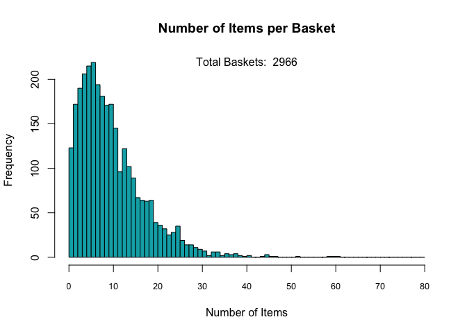
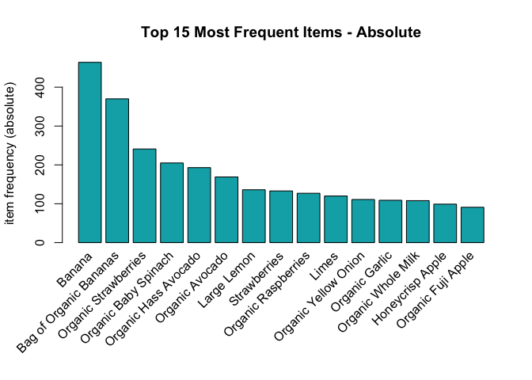
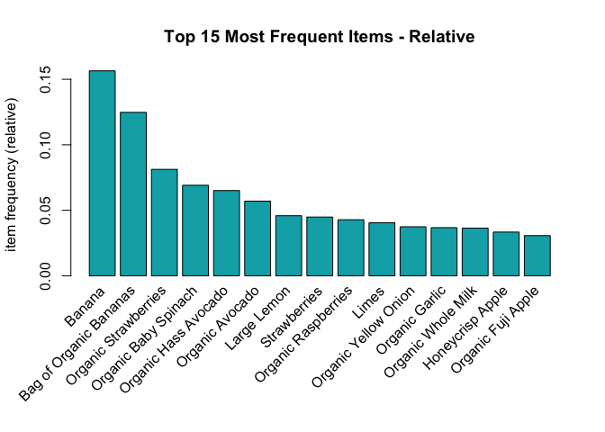
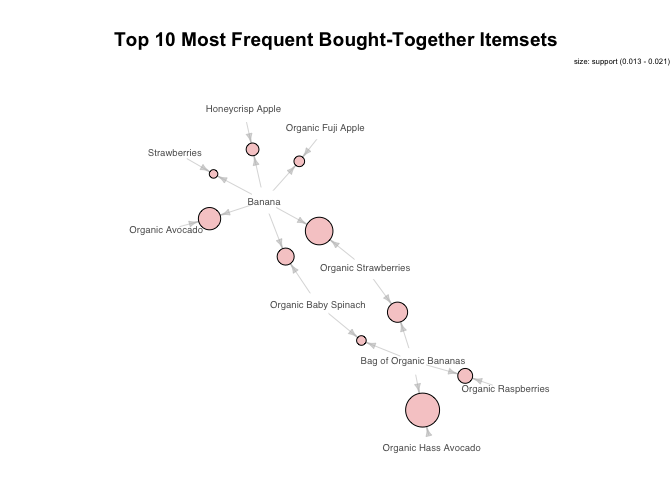
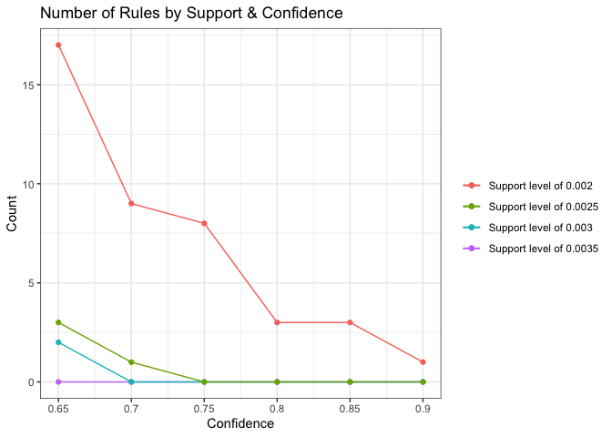
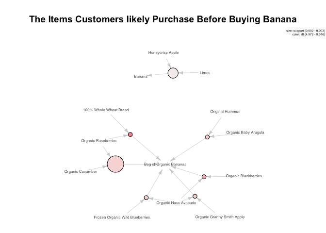

Association Rules Project
================

# 1\. Problem Statement

**Instacart** is an American technology company that operates as a
same-day grocery delivery and pick-up service in the U.S. and Canada.
Customers can shop for groceries through the Instacart mobile app or
Instacart.com from the company’s more than 300 national, regional and
local retailer partners.

This article is going to use Association Rules on Instacart transaction
data to make recommendation to help retailers. We will analyze:

1.  What’s the most frequent items?
2.  What’s the most frequent bought-together items?
3.  What will customers purchase before buying specific item?
4.  What will customers purchase after buying specific item?

# 2\. Data Preparation

The data is from
[Kaggle](https://www.kaggle.com/c/instacart-market-basket-analysis). To
focus on Association Rules Analysis, we will use two data files to do
the market data analysis. One is `order_products__prior.csv`, the other
one is `products.csv`.

``` r
# Load required packages
library(dplyr)
```

    ## 
    ## Attaching package: 'dplyr'

    ## The following objects are masked from 'package:stats':
    ## 
    ##     filter, lag

    ## The following objects are masked from 'package:base':
    ## 
    ##     intersect, setdiff, setequal, union

``` r
library(arules)
```

    ## Loading required package: Matrix

    ## 
    ## Attaching package: 'arules'

    ## The following object is masked from 'package:dplyr':
    ## 
    ##     recode

    ## The following objects are masked from 'package:base':
    ## 
    ##     abbreviate, write

``` r
library(arulesViz)
```

    ## Loading required package: grid

    ## Registered S3 method overwritten by 'seriation':
    ##   method         from 
    ##   reorder.hclust gclus

``` r
library(ggplot2)
```

``` r
# Load the data files
orders <- read.csv("order_products__prior.csv", nrows = 30000) # to reduce computability, we just load the first 30000 rows.

products <- read.csv("products.csv")
```

``` r
# Check the data structure
glimpse(orders)
```

    ## Observations: 30,000
    ## Variables: 4
    ## $ order_id          <int> 2, 2, 2, 2, 2, 2, 2, 2, 2, 3, 3, 3, 3, 3, 3, …
    ## $ product_id        <int> 33120, 28985, 9327, 45918, 30035, 17794, 4014…
    ## $ add_to_cart_order <int> 1, 2, 3, 4, 5, 6, 7, 8, 9, 1, 2, 3, 4, 5, 6, …
    ## $ reordered         <int> 1, 1, 0, 1, 0, 1, 1, 1, 0, 1, 1, 1, 1, 1, 1, …

``` r
glimpse(products)
```

    ## Observations: 49,688
    ## Variables: 4
    ## $ product_id    <int> 1, 2, 3, 4, 5, 6, 7, 8, 9, 10, 11, 12, 13, 14, 15…
    ## $ product_name  <fct> Chocolate Sandwich Cookies, All-Seasons Salt, Rob…
    ## $ aisle_id      <int> 61, 104, 94, 38, 5, 11, 98, 116, 120, 115, 31, 11…
    ## $ department_id <int> 19, 13, 7, 1, 13, 11, 7, 1, 16, 7, 7, 1, 11, 17, …

``` r
# Inspect first few rows
head(orders)
```

    ##   order_id product_id add_to_cart_order reordered
    ## 1        2      33120                 1         1
    ## 2        2      28985                 2         1
    ## 3        2       9327                 3         0
    ## 4        2      45918                 4         1
    ## 5        2      30035                 5         0
    ## 6        2      17794                 6         1

``` r
head(products)
```

    ##   product_id
    ## 1          1
    ## 2          2
    ## 3          3
    ## 4          4
    ## 5          5
    ## 6          6
    ##                                                        product_name
    ## 1                                        Chocolate Sandwich Cookies
    ## 2                                                  All-Seasons Salt
    ## 3                              Robust Golden Unsweetened Oolong Tea
    ## 4 Smart Ones Classic Favorites Mini Rigatoni With Vodka Cream Sauce
    ## 5                                         Green Chile Anytime Sauce
    ## 6                                                      Dry Nose Oil
    ##   aisle_id department_id
    ## 1       61            19
    ## 2      104            13
    ## 3       94             7
    ## 4       38             1
    ## 5        5            13
    ## 6       11            11

To analyze each baasket items, it is necessary to know what items is in
each basket/order. We just have `product id` in `orders` data but we can
combine the two dataset on `product_id` then group the data by
`odrder_id` to have `product_name` together with `order_id`.

``` r
# Join the data on product_id
df <- orders %>%
  inner_join(products, by = "product_id") %>%
  group_by(order_id) %>%
  summarise(basket = as.vector(list(product_name)))
```

``` r
# check the cleaned data
head(df)
```

    ## # A tibble: 6 x 2
    ##   order_id basket    
    ##      <int> <list>    
    ## 1        2 <fct [9]> 
    ## 2        3 <fct [8]> 
    ## 3        4 <fct [13]>
    ## 4        5 <fct [26]>
    ## 5        6 <fct [3]> 
    ## 6        7 <fct [2]>

``` r
# convert dataframe to sparse matrix for further analysis
df_tr <- as(df$basket, "transactions")
```

``` r
# check how many transactions and items
df_tr
```

    ## transactions in sparse format with
    ##  2966 transactions (rows) and
    ##  8862 items (columns)

``` r
# inspect first few transactions
inspect(head(df_tr))
```

    ##     items                                                    
    ## [1] {All Natural No Stir Creamy Almond Butter,               
    ##      Carrots,                                                
    ##      Classic Blend Cole Slaw,                                
    ##      Coconut Butter,                                         
    ##      Garlic Powder,                                          
    ##      Michigan Organic Kale,                                  
    ##      Natural Sweetener,                                      
    ##      Organic Egg Whites,                                     
    ##      Original Unflavored Gelatine Mix}                       
    ## [2] {Air Chilled Organic Boneless Skinless Chicken Breasts,  
    ##      Lemons,                                                 
    ##      Organic Baby Spinach,                                   
    ##      Organic Ezekiel 49 Bread Cinnamon Raisin,               
    ##      Organic Ginger Root,                                    
    ##      Total 2% with Strawberry Lowfat Greek Strained Yogurt,  
    ##      Unsweetened Almondmilk,                                 
    ##      Unsweetened Chocolate Almond Breeze Almond Milk}        
    ## [3] {Chewy 25% Low Sugar Chocolate Chip Granola,             
    ##      Energy Drink,                                           
    ##      Goldfish Cheddar Baked Snack Crackers,                  
    ##      Honey/Lemon Cough Drops,                                
    ##      Kellogg's Nutri-Grain Apple Cinnamon Cereal,            
    ##      Kellogg's Nutri-Grain Blueberry Cereal,                 
    ##      Nutri-Grain Soft Baked Strawberry Cereal Breakfast Bars,
    ##      Oats & Chocolate Chewy Bars,                            
    ##      Original Orange Juice,                                  
    ##      Plain Pre-Sliced Bagels,                                
    ##      Sugarfree Energy Drink,                                 
    ##      Tiny Twists Pretzels,                                   
    ##      Traditional Snack Mix}                                  
    ## [4] {2% Reduced Fat Milk,                                    
    ##      American Slices Cheese,                                 
    ##      Apricot Preserves,                                      
    ##      Artichokes,                                             
    ##      Bag of Organic Bananas,                                 
    ##      Bag of Organic Lemons,                                  
    ##      Biscuits Orange Pim's,                                  
    ##      Boneless Skinless Chicken Breast Fillets,               
    ##      Clementines,                                            
    ##      Dairy Milk Fruit & Nut Chocolate Bar,                   
    ##      Everyday  Facial Tissues,                               
    ##      French Lavender Hand Wash,                              
    ##      Fresh Fruit Salad,                                      
    ##      Just Crisp, Parmesan,                                   
    ##      Macaroni And Cheese,                                    
    ##      Matzos, Thin, Tea,                                      
    ##      Meyer Lemon,                                            
    ##      Mini Original Babybel Cheese,                           
    ##      Natural Artesian Water, Mini & Mobile,                  
    ##      One Ply Choose A Size Big Roll Paper Towel Rolls,       
    ##      Organic Hass Avocado,                                   
    ##      Organic Raspberries,                                    
    ##      Original Black Box Tablewater Cracker,                  
    ##      Sensitive Toilet Paper,                                 
    ##      Spaghetti Pasta,                                        
    ##      Wafer, Chocolate}                                       
    ## [5] {Clean Day Lavender Scent Room Freshener Spray,          
    ##      Cleanse,                                                
    ##      Dryer Sheets Geranium Scent}                            
    ## [6] {Orange Juice,                                           
    ##      Pineapple Chunks}

# 3\. Explorary Data Analysis

``` r
# Display the distribution of number of items per basket
hist(size(df_tr), breaks = 0:80, xaxt = "n",
     main = "Number of Items per Basket", xlab = "Number of Items", col = "#00ADB5")
axis(side = 1, at = seq(0, 80, by = 10), cex.axis = 0.8) # set x-axis label
mtext(paste("Total Baskets: ", length(df_tr)), line = -1) # set sub-title
```

<!-- -->

There are total 2966 baskets and the baskets with 2 to 9 items are most
frequent. Customers seldom buy more than 20 items for a single order.

``` r
itemFrequencyPlot(df_tr, topN = 15, type = "absolute", col = "#00ADB5",
                  main = "Top 15 Most Frequent Items - Absolute")
```

<!-- -->

``` r
itemFrequencyPlot(df_tr, topN = 15, type = "relative", col = "#00ADB5",
                  main = "Top 15 Most Frequent Items - Relative")
```

<!-- -->

It can be found that the top 15 most popular items are all fruits or
vegetables. Banana and organic banana is most popular with support over
0.10, then are Organic Strawberries, Organic Baby Spinach, Organic Hass
Avocado and Organic Avocado with support higher than 0.05. Two thirds of
the top 15 items are ogranic, marking organic food is very popular in
North America.

# 4\. Association Rules Analysis

#### 4.1 The Most Frequent Bought-together Itemsets

``` r
# use apriori function to get most frequent itemsets
ft_rules <- apriori(df_tr, parameter = list(target = "frequent itemsets", supp = 0.002, minlen = 2))
```

    ## Apriori
    ## 
    ## Parameter specification:
    ##  confidence minval smax arem  aval originalSupport maxtime support minlen
    ##          NA    0.1    1 none FALSE            TRUE       5   0.002      2
    ##  maxlen            target   ext
    ##      10 frequent itemsets FALSE
    ## 
    ## Algorithmic control:
    ##  filter tree heap memopt load sort verbose
    ##     0.1 TRUE TRUE  FALSE TRUE    2    TRUE
    ## 
    ## Absolute minimum support count: 5 
    ## 
    ## set item appearances ...[0 item(s)] done [0.00s].
    ## set transactions ...[8862 item(s), 2966 transaction(s)] done [0.02s].
    ## sorting and recoding items ... [1000 item(s)] done [0.00s].
    ## creating transaction tree ... done [0.00s].
    ## checking subsets of size 1 2 3 4 done [0.01s].
    ## writing ... [930 set(s)] done [0.00s].
    ## creating S4 object  ... done [0.00s].

``` r
# inspect the rules by support from high to low
inspect(sort(ft_rules, by = "support", decreasing = T)[1:10]) # top 10 itemsets
```

    ##      items                                         support    count
    ## [1]  {Bag of Organic Bananas,Organic Hass Avocado} 0.02090357 62   
    ## [2]  {Banana,Organic Strawberries}                 0.01888065 56   
    ## [3]  {Banana,Organic Avocado}                      0.01719488 51   
    ## [4]  {Bag of Organic Bananas,Organic Strawberries} 0.01652057 49   
    ## [5]  {Banana,Organic Baby Spinach}                 0.01550910 46   
    ## [6]  {Bag of Organic Bananas,Organic Raspberries}  0.01483479 44   
    ## [7]  {Banana,Honeycrisp Apple}                     0.01416049 42   
    ## [8]  {Banana,Organic Fuji Apple}                   0.01348618 40   
    ## [9]  {Bag of Organic Bananas,Organic Baby Spinach} 0.01314902 39   
    ## [10] {Banana,Strawberries}                         0.01281187 38

``` r
# Plot the top 10 itemsets
plot(sort(ft_rules, by = "support", decreasing = T)[1:10], method = "graph", control = list(cex=0.6), main = "Top 10 Most Frequent Bought-Together Itemsets")
```

<!-- -->

The items in the top 10 most frequnet bought-together itemsets are all
ranking top 15 popular items. More specificly, they are in type like
“Banana/Organic Banana” + “another top 15 poplular item”. To dig
deeper, wow we would like to know customers tend to purchase what items
before and after buying bananas.

#### 4.2 Choice of Support and Confidence

Before we move to create association rules, we need to choose
appropriate support and confidence value. So we choose a list of support
and confidence values. Because confidence shows how likely item X is
purchased when item Y is purchased, we set it at least 0.65.

``` r
# Support and confidence values
support_levels <- c(0.0035, 0.003, 0.0025, 0.002)
confidence_levels <- seq(0.9, 0.65, by = -0.05)

# Create empty integers for each support level
library(hash)
```

    ## hash-2.2.6.1 provided by Decision Patterns

``` r
d <- hash()
k <- 1

# Calculate the number of rules under different support and confidence level
for(i in support_levels) {
  rules_count <- integer(length = length(confidence_levels))
  
  for(j in 1:length(confidence_levels)) {
    rules_count[j] <- length(apriori(df_tr, parameter = list(support=i, confidence=confidence_levels[j], target = "rules", minlen = 2)))
  }

  nam <- paste("rules_supp_", i, sep = "")
  assign(nam, rules_count)
  d[[toString(k)]] <- rules_count
  k <- k + 1
}
```

    ## Apriori
    ## 
    ## Parameter specification:
    ##  confidence minval smax arem  aval originalSupport maxtime support minlen
    ##         0.9    0.1    1 none FALSE            TRUE       5  0.0035      2
    ##  maxlen target   ext
    ##      10  rules FALSE
    ## 
    ## Algorithmic control:
    ##  filter tree heap memopt load sort verbose
    ##     0.1 TRUE TRUE  FALSE TRUE    2    TRUE
    ## 
    ## Absolute minimum support count: 10 
    ## 
    ## set item appearances ...[0 item(s)] done [0.00s].
    ## set transactions ...[8862 item(s), 2966 transaction(s)] done [0.03s].
    ## sorting and recoding items ... [430 item(s)] done [0.00s].
    ## creating transaction tree ... done [0.00s].
    ## checking subsets of size 1 2 3 done [0.00s].
    ## writing ... [0 rule(s)] done [0.00s].
    ## creating S4 object  ... done [0.00s].
    ## Apriori
    ## 
    ## Parameter specification:
    ##  confidence minval smax arem  aval originalSupport maxtime support minlen
    ##        0.85    0.1    1 none FALSE            TRUE       5  0.0035      2
    ##  maxlen target   ext
    ##      10  rules FALSE
    ## 
    ## Algorithmic control:
    ##  filter tree heap memopt load sort verbose
    ##     0.1 TRUE TRUE  FALSE TRUE    2    TRUE
    ## 
    ## Absolute minimum support count: 10 
    ## 
    ## set item appearances ...[0 item(s)] done [0.00s].
    ## set transactions ...[8862 item(s), 2966 transaction(s)] done [0.01s].
    ## sorting and recoding items ... [430 item(s)] done [0.00s].
    ## creating transaction tree ... done [0.00s].
    ## checking subsets of size 1 2 3 done [0.00s].
    ## writing ... [0 rule(s)] done [0.00s].
    ## creating S4 object  ... done [0.00s].
    ## Apriori
    ## 
    ## Parameter specification:
    ##  confidence minval smax arem  aval originalSupport maxtime support minlen
    ##         0.8    0.1    1 none FALSE            TRUE       5  0.0035      2
    ##  maxlen target   ext
    ##      10  rules FALSE
    ## 
    ## Algorithmic control:
    ##  filter tree heap memopt load sort verbose
    ##     0.1 TRUE TRUE  FALSE TRUE    2    TRUE
    ## 
    ## Absolute minimum support count: 10 
    ## 
    ## set item appearances ...[0 item(s)] done [0.00s].
    ## set transactions ...[8862 item(s), 2966 transaction(s)] done [0.02s].
    ## sorting and recoding items ... [430 item(s)] done [0.00s].
    ## creating transaction tree ... done [0.00s].
    ## checking subsets of size 1 2 3 done [0.00s].
    ## writing ... [0 rule(s)] done [0.00s].
    ## creating S4 object  ... done [0.00s].
    ## Apriori
    ## 
    ## Parameter specification:
    ##  confidence minval smax arem  aval originalSupport maxtime support minlen
    ##        0.75    0.1    1 none FALSE            TRUE       5  0.0035      2
    ##  maxlen target   ext
    ##      10  rules FALSE
    ## 
    ## Algorithmic control:
    ##  filter tree heap memopt load sort verbose
    ##     0.1 TRUE TRUE  FALSE TRUE    2    TRUE
    ## 
    ## Absolute minimum support count: 10 
    ## 
    ## set item appearances ...[0 item(s)] done [0.00s].
    ## set transactions ...[8862 item(s), 2966 transaction(s)] done [0.01s].
    ## sorting and recoding items ... [430 item(s)] done [0.00s].
    ## creating transaction tree ... done [0.00s].
    ## checking subsets of size 1 2 3 done [0.00s].
    ## writing ... [0 rule(s)] done [0.00s].
    ## creating S4 object  ... done [0.00s].
    ## Apriori
    ## 
    ## Parameter specification:
    ##  confidence minval smax arem  aval originalSupport maxtime support minlen
    ##         0.7    0.1    1 none FALSE            TRUE       5  0.0035      2
    ##  maxlen target   ext
    ##      10  rules FALSE
    ## 
    ## Algorithmic control:
    ##  filter tree heap memopt load sort verbose
    ##     0.1 TRUE TRUE  FALSE TRUE    2    TRUE
    ## 
    ## Absolute minimum support count: 10 
    ## 
    ## set item appearances ...[0 item(s)] done [0.00s].
    ## set transactions ...[8862 item(s), 2966 transaction(s)] done [0.02s].
    ## sorting and recoding items ... [430 item(s)] done [0.00s].
    ## creating transaction tree ... done [0.00s].
    ## checking subsets of size 1 2 3 done [0.00s].
    ## writing ... [0 rule(s)] done [0.00s].
    ## creating S4 object  ... done [0.00s].
    ## Apriori
    ## 
    ## Parameter specification:
    ##  confidence minval smax arem  aval originalSupport maxtime support minlen
    ##        0.65    0.1    1 none FALSE            TRUE       5  0.0035      2
    ##  maxlen target   ext
    ##      10  rules FALSE
    ## 
    ## Algorithmic control:
    ##  filter tree heap memopt load sort verbose
    ##     0.1 TRUE TRUE  FALSE TRUE    2    TRUE
    ## 
    ## Absolute minimum support count: 10 
    ## 
    ## set item appearances ...[0 item(s)] done [0.00s].
    ## set transactions ...[8862 item(s), 2966 transaction(s)] done [0.01s].
    ## sorting and recoding items ... [430 item(s)] done [0.00s].
    ## creating transaction tree ... done [0.00s].
    ## checking subsets of size 1 2 3 done [0.00s].
    ## writing ... [0 rule(s)] done [0.00s].
    ## creating S4 object  ... done [0.00s].
    ## Apriori
    ## 
    ## Parameter specification:
    ##  confidence minval smax arem  aval originalSupport maxtime support minlen
    ##         0.9    0.1    1 none FALSE            TRUE       5   0.003      2
    ##  maxlen target   ext
    ##      10  rules FALSE
    ## 
    ## Algorithmic control:
    ##  filter tree heap memopt load sort verbose
    ##     0.1 TRUE TRUE  FALSE TRUE    2    TRUE
    ## 
    ## Absolute minimum support count: 8 
    ## 
    ## set item appearances ...[0 item(s)] done [0.00s].
    ## set transactions ...[8862 item(s), 2966 transaction(s)] done [0.01s].
    ## sorting and recoding items ... [579 item(s)] done [0.00s].
    ## creating transaction tree ... done [0.00s].
    ## checking subsets of size 1 2 3 done [0.00s].
    ## writing ... [0 rule(s)] done [0.00s].
    ## creating S4 object  ... done [0.00s].
    ## Apriori
    ## 
    ## Parameter specification:
    ##  confidence minval smax arem  aval originalSupport maxtime support minlen
    ##        0.85    0.1    1 none FALSE            TRUE       5   0.003      2
    ##  maxlen target   ext
    ##      10  rules FALSE
    ## 
    ## Algorithmic control:
    ##  filter tree heap memopt load sort verbose
    ##     0.1 TRUE TRUE  FALSE TRUE    2    TRUE
    ## 
    ## Absolute minimum support count: 8 
    ## 
    ## set item appearances ...[0 item(s)] done [0.00s].
    ## set transactions ...[8862 item(s), 2966 transaction(s)] done [0.01s].
    ## sorting and recoding items ... [579 item(s)] done [0.00s].
    ## creating transaction tree ... done [0.00s].
    ## checking subsets of size 1 2 3 done [0.00s].
    ## writing ... [0 rule(s)] done [0.00s].
    ## creating S4 object  ... done [0.00s].
    ## Apriori
    ## 
    ## Parameter specification:
    ##  confidence minval smax arem  aval originalSupport maxtime support minlen
    ##         0.8    0.1    1 none FALSE            TRUE       5   0.003      2
    ##  maxlen target   ext
    ##      10  rules FALSE
    ## 
    ## Algorithmic control:
    ##  filter tree heap memopt load sort verbose
    ##     0.1 TRUE TRUE  FALSE TRUE    2    TRUE
    ## 
    ## Absolute minimum support count: 8 
    ## 
    ## set item appearances ...[0 item(s)] done [0.00s].
    ## set transactions ...[8862 item(s), 2966 transaction(s)] done [0.01s].
    ## sorting and recoding items ... [579 item(s)] done [0.00s].
    ## creating transaction tree ... done [0.00s].
    ## checking subsets of size 1 2 3 done [0.00s].
    ## writing ... [0 rule(s)] done [0.00s].
    ## creating S4 object  ... done [0.00s].
    ## Apriori
    ## 
    ## Parameter specification:
    ##  confidence minval smax arem  aval originalSupport maxtime support minlen
    ##        0.75    0.1    1 none FALSE            TRUE       5   0.003      2
    ##  maxlen target   ext
    ##      10  rules FALSE
    ## 
    ## Algorithmic control:
    ##  filter tree heap memopt load sort verbose
    ##     0.1 TRUE TRUE  FALSE TRUE    2    TRUE
    ## 
    ## Absolute minimum support count: 8 
    ## 
    ## set item appearances ...[0 item(s)] done [0.00s].
    ## set transactions ...[8862 item(s), 2966 transaction(s)] done [0.02s].
    ## sorting and recoding items ... [579 item(s)] done [0.00s].
    ## creating transaction tree ... done [0.00s].
    ## checking subsets of size 1 2 3 done [0.00s].
    ## writing ... [0 rule(s)] done [0.00s].
    ## creating S4 object  ... done [0.00s].
    ## Apriori
    ## 
    ## Parameter specification:
    ##  confidence minval smax arem  aval originalSupport maxtime support minlen
    ##         0.7    0.1    1 none FALSE            TRUE       5   0.003      2
    ##  maxlen target   ext
    ##      10  rules FALSE
    ## 
    ## Algorithmic control:
    ##  filter tree heap memopt load sort verbose
    ##     0.1 TRUE TRUE  FALSE TRUE    2    TRUE
    ## 
    ## Absolute minimum support count: 8 
    ## 
    ## set item appearances ...[0 item(s)] done [0.00s].
    ## set transactions ...[8862 item(s), 2966 transaction(s)] done [0.01s].
    ## sorting and recoding items ... [579 item(s)] done [0.00s].
    ## creating transaction tree ... done [0.00s].
    ## checking subsets of size 1 2 3 done [0.00s].
    ## writing ... [0 rule(s)] done [0.00s].
    ## creating S4 object  ... done [0.00s].
    ## Apriori
    ## 
    ## Parameter specification:
    ##  confidence minval smax arem  aval originalSupport maxtime support minlen
    ##        0.65    0.1    1 none FALSE            TRUE       5   0.003      2
    ##  maxlen target   ext
    ##      10  rules FALSE
    ## 
    ## Algorithmic control:
    ##  filter tree heap memopt load sort verbose
    ##     0.1 TRUE TRUE  FALSE TRUE    2    TRUE
    ## 
    ## Absolute minimum support count: 8 
    ## 
    ## set item appearances ...[0 item(s)] done [0.00s].
    ## set transactions ...[8862 item(s), 2966 transaction(s)] done [0.01s].
    ## sorting and recoding items ... [579 item(s)] done [0.00s].
    ## creating transaction tree ... done [0.00s].
    ## checking subsets of size 1 2 3 done [0.01s].
    ## writing ... [2 rule(s)] done [0.00s].
    ## creating S4 object  ... done [0.00s].
    ## Apriori
    ## 
    ## Parameter specification:
    ##  confidence minval smax arem  aval originalSupport maxtime support minlen
    ##         0.9    0.1    1 none FALSE            TRUE       5  0.0025      2
    ##  maxlen target   ext
    ##      10  rules FALSE
    ## 
    ## Algorithmic control:
    ##  filter tree heap memopt load sort verbose
    ##     0.1 TRUE TRUE  FALSE TRUE    2    TRUE
    ## 
    ## Absolute minimum support count: 7 
    ## 
    ## set item appearances ...[0 item(s)] done [0.00s].
    ## set transactions ...[8862 item(s), 2966 transaction(s)] done [0.01s].
    ## sorting and recoding items ... [671 item(s)] done [0.00s].
    ## creating transaction tree ... done [0.00s].
    ## checking subsets of size 1 2 3 done [0.00s].
    ## writing ... [0 rule(s)] done [0.00s].
    ## creating S4 object  ... done [0.00s].
    ## Apriori
    ## 
    ## Parameter specification:
    ##  confidence minval smax arem  aval originalSupport maxtime support minlen
    ##        0.85    0.1    1 none FALSE            TRUE       5  0.0025      2
    ##  maxlen target   ext
    ##      10  rules FALSE
    ## 
    ## Algorithmic control:
    ##  filter tree heap memopt load sort verbose
    ##     0.1 TRUE TRUE  FALSE TRUE    2    TRUE
    ## 
    ## Absolute minimum support count: 7 
    ## 
    ## set item appearances ...[0 item(s)] done [0.00s].
    ## set transactions ...[8862 item(s), 2966 transaction(s)] done [0.01s].
    ## sorting and recoding items ... [671 item(s)] done [0.00s].
    ## creating transaction tree ... done [0.00s].
    ## checking subsets of size 1 2 3 done [0.00s].
    ## writing ... [0 rule(s)] done [0.00s].
    ## creating S4 object  ... done [0.00s].
    ## Apriori
    ## 
    ## Parameter specification:
    ##  confidence minval smax arem  aval originalSupport maxtime support minlen
    ##         0.8    0.1    1 none FALSE            TRUE       5  0.0025      2
    ##  maxlen target   ext
    ##      10  rules FALSE
    ## 
    ## Algorithmic control:
    ##  filter tree heap memopt load sort verbose
    ##     0.1 TRUE TRUE  FALSE TRUE    2    TRUE
    ## 
    ## Absolute minimum support count: 7 
    ## 
    ## set item appearances ...[0 item(s)] done [0.00s].
    ## set transactions ...[8862 item(s), 2966 transaction(s)] done [0.01s].
    ## sorting and recoding items ... [671 item(s)] done [0.00s].
    ## creating transaction tree ... done [0.00s].
    ## checking subsets of size 1 2 3 done [0.01s].
    ## writing ... [0 rule(s)] done [0.00s].
    ## creating S4 object  ... done [0.00s].
    ## Apriori
    ## 
    ## Parameter specification:
    ##  confidence minval smax arem  aval originalSupport maxtime support minlen
    ##        0.75    0.1    1 none FALSE            TRUE       5  0.0025      2
    ##  maxlen target   ext
    ##      10  rules FALSE
    ## 
    ## Algorithmic control:
    ##  filter tree heap memopt load sort verbose
    ##     0.1 TRUE TRUE  FALSE TRUE    2    TRUE
    ## 
    ## Absolute minimum support count: 7 
    ## 
    ## set item appearances ...[0 item(s)] done [0.00s].
    ## set transactions ...[8862 item(s), 2966 transaction(s)] done [0.01s].
    ## sorting and recoding items ... [671 item(s)] done [0.00s].
    ## creating transaction tree ... done [0.00s].
    ## checking subsets of size 1 2 3 done [0.00s].
    ## writing ... [0 rule(s)] done [0.00s].
    ## creating S4 object  ... done [0.00s].
    ## Apriori
    ## 
    ## Parameter specification:
    ##  confidence minval smax arem  aval originalSupport maxtime support minlen
    ##         0.7    0.1    1 none FALSE            TRUE       5  0.0025      2
    ##  maxlen target   ext
    ##      10  rules FALSE
    ## 
    ## Algorithmic control:
    ##  filter tree heap memopt load sort verbose
    ##     0.1 TRUE TRUE  FALSE TRUE    2    TRUE
    ## 
    ## Absolute minimum support count: 7 
    ## 
    ## set item appearances ...[0 item(s)] done [0.00s].
    ## set transactions ...[8862 item(s), 2966 transaction(s)] done [0.01s].
    ## sorting and recoding items ... [671 item(s)] done [0.00s].
    ## creating transaction tree ... done [0.00s].
    ## checking subsets of size 1 2 3 done [0.00s].
    ## writing ... [1 rule(s)] done [0.00s].
    ## creating S4 object  ... done [0.00s].
    ## Apriori
    ## 
    ## Parameter specification:
    ##  confidence minval smax arem  aval originalSupport maxtime support minlen
    ##        0.65    0.1    1 none FALSE            TRUE       5  0.0025      2
    ##  maxlen target   ext
    ##      10  rules FALSE
    ## 
    ## Algorithmic control:
    ##  filter tree heap memopt load sort verbose
    ##     0.1 TRUE TRUE  FALSE TRUE    2    TRUE
    ## 
    ## Absolute minimum support count: 7 
    ## 
    ## set item appearances ...[0 item(s)] done [0.00s].
    ## set transactions ...[8862 item(s), 2966 transaction(s)] done [0.02s].
    ## sorting and recoding items ... [671 item(s)] done [0.00s].
    ## creating transaction tree ... done [0.00s].
    ## checking subsets of size 1 2 3 done [0.00s].
    ## writing ... [3 rule(s)] done [0.00s].
    ## creating S4 object  ... done [0.00s].
    ## Apriori
    ## 
    ## Parameter specification:
    ##  confidence minval smax arem  aval originalSupport maxtime support minlen
    ##         0.9    0.1    1 none FALSE            TRUE       5   0.002      2
    ##  maxlen target   ext
    ##      10  rules FALSE
    ## 
    ## Algorithmic control:
    ##  filter tree heap memopt load sort verbose
    ##     0.1 TRUE TRUE  FALSE TRUE    2    TRUE
    ## 
    ## Absolute minimum support count: 5 
    ## 
    ## set item appearances ...[0 item(s)] done [0.00s].
    ## set transactions ...[8862 item(s), 2966 transaction(s)] done [0.01s].
    ## sorting and recoding items ... [1000 item(s)] done [0.00s].
    ## creating transaction tree ... done [0.00s].
    ## checking subsets of size 1 2 3 4 done [0.01s].
    ## writing ... [1 rule(s)] done [0.00s].
    ## creating S4 object  ... done [0.00s].
    ## Apriori
    ## 
    ## Parameter specification:
    ##  confidence minval smax arem  aval originalSupport maxtime support minlen
    ##        0.85    0.1    1 none FALSE            TRUE       5   0.002      2
    ##  maxlen target   ext
    ##      10  rules FALSE
    ## 
    ## Algorithmic control:
    ##  filter tree heap memopt load sort verbose
    ##     0.1 TRUE TRUE  FALSE TRUE    2    TRUE
    ## 
    ## Absolute minimum support count: 5 
    ## 
    ## set item appearances ...[0 item(s)] done [0.00s].
    ## set transactions ...[8862 item(s), 2966 transaction(s)] done [0.02s].
    ## sorting and recoding items ... [1000 item(s)] done [0.00s].
    ## creating transaction tree ... done [0.00s].
    ## checking subsets of size 1 2 3 4 done [0.01s].
    ## writing ... [3 rule(s)] done [0.00s].
    ## creating S4 object  ... done [0.00s].
    ## Apriori
    ## 
    ## Parameter specification:
    ##  confidence minval smax arem  aval originalSupport maxtime support minlen
    ##         0.8    0.1    1 none FALSE            TRUE       5   0.002      2
    ##  maxlen target   ext
    ##      10  rules FALSE
    ## 
    ## Algorithmic control:
    ##  filter tree heap memopt load sort verbose
    ##     0.1 TRUE TRUE  FALSE TRUE    2    TRUE
    ## 
    ## Absolute minimum support count: 5 
    ## 
    ## set item appearances ...[0 item(s)] done [0.00s].
    ## set transactions ...[8862 item(s), 2966 transaction(s)] done [0.01s].
    ## sorting and recoding items ... [1000 item(s)] done [0.00s].
    ## creating transaction tree ... done [0.00s].
    ## checking subsets of size 1 2 3 4 done [0.01s].
    ## writing ... [3 rule(s)] done [0.00s].
    ## creating S4 object  ... done [0.00s].
    ## Apriori
    ## 
    ## Parameter specification:
    ##  confidence minval smax arem  aval originalSupport maxtime support minlen
    ##        0.75    0.1    1 none FALSE            TRUE       5   0.002      2
    ##  maxlen target   ext
    ##      10  rules FALSE
    ## 
    ## Algorithmic control:
    ##  filter tree heap memopt load sort verbose
    ##     0.1 TRUE TRUE  FALSE TRUE    2    TRUE
    ## 
    ## Absolute minimum support count: 5 
    ## 
    ## set item appearances ...[0 item(s)] done [0.00s].
    ## set transactions ...[8862 item(s), 2966 transaction(s)] done [0.02s].
    ## sorting and recoding items ... [1000 item(s)] done [0.00s].
    ## creating transaction tree ... done [0.00s].
    ## checking subsets of size 1 2 3 4 done [0.01s].
    ## writing ... [8 rule(s)] done [0.00s].
    ## creating S4 object  ... done [0.00s].
    ## Apriori
    ## 
    ## Parameter specification:
    ##  confidence minval smax arem  aval originalSupport maxtime support minlen
    ##         0.7    0.1    1 none FALSE            TRUE       5   0.002      2
    ##  maxlen target   ext
    ##      10  rules FALSE
    ## 
    ## Algorithmic control:
    ##  filter tree heap memopt load sort verbose
    ##     0.1 TRUE TRUE  FALSE TRUE    2    TRUE
    ## 
    ## Absolute minimum support count: 5 
    ## 
    ## set item appearances ...[0 item(s)] done [0.00s].
    ## set transactions ...[8862 item(s), 2966 transaction(s)] done [0.01s].
    ## sorting and recoding items ... [1000 item(s)] done [0.00s].
    ## creating transaction tree ... done [0.00s].
    ## checking subsets of size 1 2 3 4 done [0.01s].
    ## writing ... [9 rule(s)] done [0.00s].
    ## creating S4 object  ... done [0.00s].
    ## Apriori
    ## 
    ## Parameter specification:
    ##  confidence minval smax arem  aval originalSupport maxtime support minlen
    ##        0.65    0.1    1 none FALSE            TRUE       5   0.002      2
    ##  maxlen target   ext
    ##      10  rules FALSE
    ## 
    ## Algorithmic control:
    ##  filter tree heap memopt load sort verbose
    ##     0.1 TRUE TRUE  FALSE TRUE    2    TRUE
    ## 
    ## Absolute minimum support count: 5 
    ## 
    ## set item appearances ...[0 item(s)] done [0.00s].
    ## set transactions ...[8862 item(s), 2966 transaction(s)] done [0.02s].
    ## sorting and recoding items ... [1000 item(s)] done [0.00s].
    ## creating transaction tree ... done [0.00s].
    ## checking subsets of size 1 2 3 4 done [0.01s].
    ## writing ... [17 rule(s)] done [0.00s].
    ## creating S4 object  ... done [0.00s].

``` r
# combine the four datasets with different support level
num_rules <- data.frame(d[["1"]], d[["2"]], d[["3"]], d[["4"]], confidence_levels)

# plot the rules numbers in different support and confidence levels
ggplot(num_rules, aes(x = confidence_levels)) +
    
  geom_line(aes(y = d[["1"]], color = paste("Support level of", support_levels[1]))) +
  geom_point(aes(y = d[["1"]], color = paste("Support level of", support_levels[1]))) +
  
  geom_line(aes(y = d[["2"]], color = paste("Support level of", support_levels[2]))) +
  geom_point(aes(y = d[["2"]], color = paste("Support level of", support_levels[2]))) +
  
  geom_line(aes(y = d[["3"]], color = paste("Support level of", support_levels[3]))) +
  geom_point(aes(y = d[["3"]], color = paste("Support level of", support_levels[3]))) +
  
  geom_line(aes(y = d[["4"]], color = paste("Support level of", support_levels[4]))) +
  geom_point(aes(y = d[["4"]], color = paste("Support level of", support_levels[4]))) +
  
  scale_x_continuous(breaks = seq(0.65, 0.9, by = 0.05), # label the confidence values
                     labels = seq(0.65, 0.9, by = 0.05)) +
  
  labs(title = "Number of Rules by Support & Confidence",
       x = "Confidence", y = "Count") +
  
  theme_bw() + # set theme to blankwhite
  theme(legend.title = element_blank())
```

<!-- -->

To ensure enough rules for analysis, we choose `support = 0.002` and
`confidence = 0.7` to create association rules, as it have about 9 rules
under this condition.

#### 4.3 What Items Would Customers Purchase Before Buying Banana?

``` r
# create association rules with support 0.002, confidence 0.65
rules_1 <- apriori(df_tr, parameter = list(supp = 0.002, conf = 0.7))
```

    ## Apriori
    ## 
    ## Parameter specification:
    ##  confidence minval smax arem  aval originalSupport maxtime support minlen
    ##         0.7    0.1    1 none FALSE            TRUE       5   0.002      1
    ##  maxlen target   ext
    ##      10  rules FALSE
    ## 
    ## Algorithmic control:
    ##  filter tree heap memopt load sort verbose
    ##     0.1 TRUE TRUE  FALSE TRUE    2    TRUE
    ## 
    ## Absolute minimum support count: 5 
    ## 
    ## set item appearances ...[0 item(s)] done [0.00s].
    ## set transactions ...[8862 item(s), 2966 transaction(s)] done [0.01s].
    ## sorting and recoding items ... [1000 item(s)] done [0.00s].
    ## creating transaction tree ... done [0.00s].
    ## checking subsets of size 1 2 3 4 done [0.01s].
    ## writing ... [9 rule(s)] done [0.00s].
    ## creating S4 object  ... done [0.00s].

``` r
inspect(rules_1)
```

    ##     lhs                                              rhs                                           support confidence       lift count
    ## [1] {Blueberry on the Bottom Nonfat Greek Yogurt} => {Peach on the Bottom Nonfat Greek Yogurt} 0.002022927  0.8571429 181.591837     6
    ## [2] {Frozen Organic Wild Blueberries,                                                                                                 
    ##      Organic Hass Avocado}                        => {Bag of Organic Bananas}                  0.002022927  0.7500000   6.012162     6
    ## [3] {100% Whole Wheat Bread,                                                                                                          
    ##      Organic Raspberries}                         => {Bag of Organic Bananas}                  0.002022927  1.0000000   8.016216     6
    ## [4] {Organic Baby Arugula,                                                                                                            
    ##      Original Hummus}                             => {Bag of Organic Bananas}                  0.002022927  0.7500000   6.012162     6
    ## [5] {Organic Blackberries,                                                                                                            
    ##      Organic Hass Avocado}                        => {Bag of Organic Bananas}                  0.002022927  0.8571429   6.871042     6
    ## [6] {Organic Granny Smith Apple,                                                                                                      
    ##      Organic Hass Avocado}                        => {Bag of Organic Bananas}                  0.002022927  0.7500000   6.012162     6
    ## [7] {Organic Avocado,                                                                                                                 
    ##      Organic Cilantro}                            => {Organic Strawberries}                    0.002360081  0.7777778   9.572153     7
    ## [8] {Organic Cucumber,                                                                                                                
    ##      Organic Raspberries}                         => {Bag of Organic Bananas}                  0.002697235  0.7272727   5.829975     8
    ## [9] {Honeycrisp Apple,                                                                                                                
    ##      Limes}                                       => {Banana}                                  0.002360081  0.7777778   4.971743     7

``` r
# filter and sort the rules with "Banana" in right hand side
bf_bnn <- sort(subset(rules_1, subset = rhs %pin% "Banana"), by = "confidence", decreasing = T)
inspect(bf_bnn)
```

    ##     lhs                                  rhs                          support confidence     lift count
    ## [1] {100% Whole Wheat Bread,                                                                           
    ##      Organic Raspberries}             => {Bag of Organic Bananas} 0.002022927  1.0000000 8.016216     6
    ## [2] {Organic Blackberries,                                                                             
    ##      Organic Hass Avocado}            => {Bag of Organic Bananas} 0.002022927  0.8571429 6.871042     6
    ## [3] {Honeycrisp Apple,                                                                                 
    ##      Limes}                           => {Banana}                 0.002360081  0.7777778 4.971743     7
    ## [4] {Frozen Organic Wild Blueberries,                                                                  
    ##      Organic Hass Avocado}            => {Bag of Organic Bananas} 0.002022927  0.7500000 6.012162     6
    ## [5] {Organic Baby Arugula,                                                                             
    ##      Original Hummus}                 => {Bag of Organic Bananas} 0.002022927  0.7500000 6.012162     6
    ## [6] {Organic Granny Smith Apple,                                                                       
    ##      Organic Hass Avocado}            => {Bag of Organic Bananas} 0.002022927  0.7500000 6.012162     6
    ## [7] {Organic Cucumber,                                                                                 
    ##      Organic Raspberries}             => {Bag of Organic Bananas} 0.002697235  0.7272727 5.829975     8

As we can see from the result, there are total 9 rules and 7 of the 9
are with `Banana` on right hand side. Let’s plot the them.

``` r
plot(bf_bnn, method = "graph", control = list(cex=0.5), 
     main = "The Items Customers likely Purchase Before Buying Banana")
```

<!-- -->

From above data and plot, we can find that: 1. Customers buying
`Honeycrisp Apple` and `Limes` are very likely to buy `Banana`; 2.
Customers buying organic fruit including `Avocado`, `Blackberries` etc
are very likely to purchase `Organic Banana`; 3. All the time customers
buying `100% Whole Wheat Bread`, `Organic Raspberries`, customers
finally purchase `Organic Banana`. If this is not single customer’s
behavior, we can recommend `Banana` after customers add `100% Whole
Wheat Bread`, `Organic Raspberries` to cart.

#### 4.4 Other High-Confidence Rules

As there are no rules from our model with `Banana` on left hand side, we
move to analyze other rules without `Banan` from the model.

``` r
# filter the rules without Banana on rhs
other_rule <- sort(subset(rules_1, !(rhs %pin% "Banana")), by = "confidence", decreasing = T)
inspect(other_rule)
```

    ##     lhs                                              rhs                                           support confidence       lift count
    ## [1] {Blueberry on the Bottom Nonfat Greek Yogurt} => {Peach on the Bottom Nonfat Greek Yogurt} 0.002022927  0.8571429 181.591837     6
    ## [2] {Organic Avocado,                                                                                                                 
    ##      Organic Cilantro}                            => {Organic Strawberries}                    0.002360081  0.7777778   9.572153     7

We got another 2 rules that could be used for recommendation system.

``` r
# List all the 9 rules by confidence level from high to low
selected_rules <- DATAFRAME(rules_1) %>%
  arrange(desc(confidence))
recomm <- paste(selected_rules$LHS, "=>", selected_rules$RHS)
```

# 5\. Conclusion

1.  `Banana`,`Bag of Organic Bananas`, `Organic Straberries`, `Organic
    Baby Spinach`, `Organic Hass Avocado` and `Organic Avocado` are most
    frequent items with support value higher than 0.05.

2.  To boost the sales, we can build the recommendations with below
    rules:

<!-- end list -->

    ## [1] "{100% Whole Wheat Bread,Organic Raspberries} => {Bag of Organic Bananas}"                  
    ## [2] "{Blueberry on the Bottom Nonfat Greek Yogurt} => {Peach on the Bottom Nonfat Greek Yogurt}"
    ## [3] "{Organic Blackberries,Organic Hass Avocado} => {Bag of Organic Bananas}"                   
    ## [4] "{Organic Avocado,Organic Cilantro} => {Organic Strawberries}"                              
    ## [5] "{Honeycrisp Apple,Limes} => {Banana}"                                                      
    ## [6] "{Frozen Organic Wild Blueberries,Organic Hass Avocado} => {Bag of Organic Bananas}"        
    ## [7] "{Organic Baby Arugula,Original Hummus} => {Bag of Organic Bananas}"                        
    ## [8] "{Organic Granny Smith Apple,Organic Hass Avocado} => {Bag of Organic Bananas}"             
    ## [9] "{Organic Cucumber,Organic Raspberries} => {Bag of Organic Bananas}"
